# FitFind — System Workflows

- **Related Document:** Software Requirements Specification (SRS)
- **SRS Version:** 1.7
- **Document Version:** 1.0
- **Status:** Draft
- **Document Type:** Business Process Workflows

---

## 1. User Registration and Authentication

**Priority:** P0 — MVP

### 1.1 User Registration

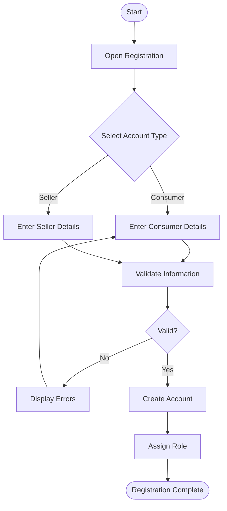
```mermaid
flowchart TD
    A([Start]) --> B[Open Registration]
    B --> C{Select Account Type}
    C -->|Consumer| D[Enter Consumer Details]
    C -->|Seller| E[Enter Seller Details]
    D --> F[Validate Information]
    E --> F
    F --> G{Valid?}
    G -->|No| H[Display Errors]
    H --> D
    G -->|Yes| I[Create Account]
    I --> J[Assign Role]
    J --> K([Registration Complete])
```

### 1.2 User Login

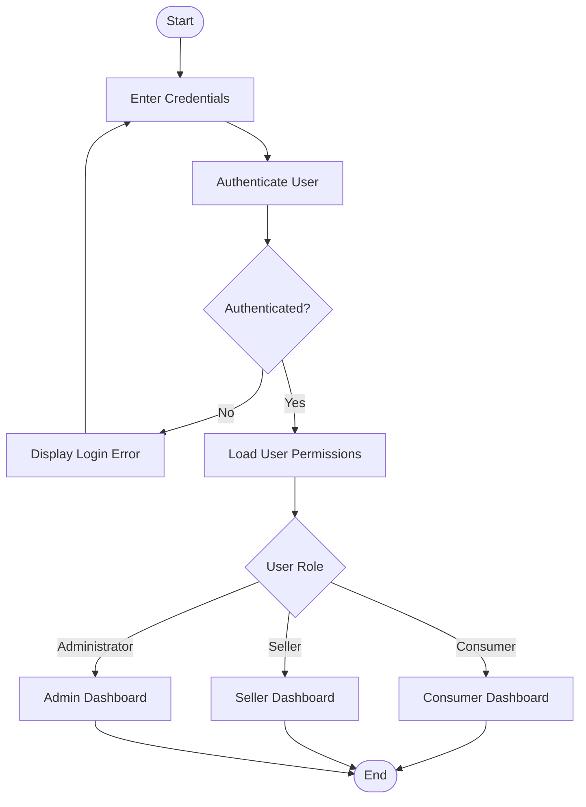
```mermaid
flowchart TD
    A([Start]) --> B[Enter Credentials]
    B --> C[Authenticate User]
    C --> D{Authenticated?}
    D -->|No| E[Display Login Error]
    E --> B
    D -->|Yes| F[Load User Permissions]
    F --> G{User Role}
    G -->|Consumer| H[Consumer Dashboard]
    G -->|Seller| I[Seller Dashboard]
    G -->|Administrator| J[Admin Dashboard]
    H --> K([End])
    I --> K
    J --> K
```

---

## 2. Seller Registration and Verification

**Priority:** P0 — MVP

### 2.1 Seller Registration

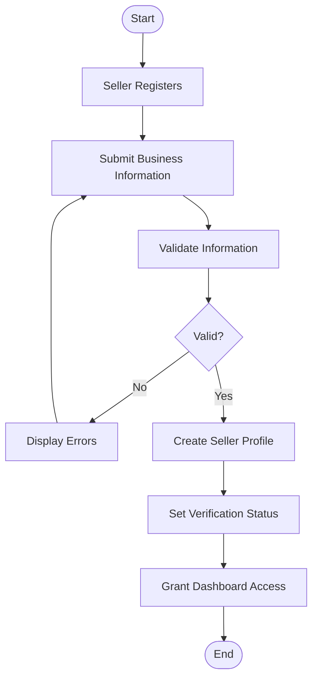
```mermaid
flowchart TD
    A([Start]) --> B[Seller Registers]
    B --> C[Submit Business Information]
    C --> D[Validate Information]
    D --> E{Valid?}
    E -->|No| F[Display Errors]
    F --> C
    E -->|Yes| G[Create Seller Profile]
    G --> H[Set Verification Status]
    H --> I[Grant Dashboard Access]
    I --> J([End])
```

### 2.2 Seller Verification

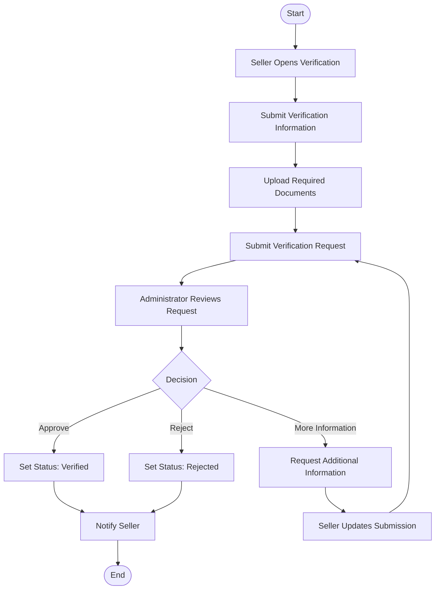
```mermaid
flowchart TD
    A([Start]) --> B[Seller Opens Verification]
    B --> C[Submit Verification Information]
    C --> D[Upload Required Documents]
    D --> E[Submit Verification Request]
    E --> F[Administrator Reviews Request]
    F --> G{Decision}
    G -->|Approve| H[Set Status: Verified]
    G -->|Reject| I[Set Status: Rejected]
    G -->|More Information| J[Request Additional Information]
    J --> K[Seller Updates Submission]
    K --> E
    H --> L[Notify Seller]
    I --> L
    L --> M([End])
```

---

## 3. Store Management

**Priority:** P0 — MVP

### 3.1 Create and Update Store

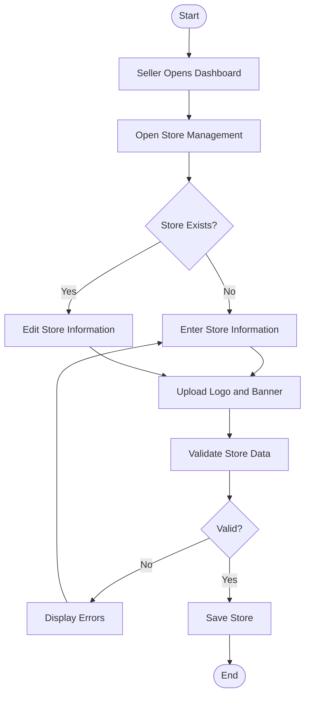
```mermaid
flowchart TD
    A([Start]) --> B[Seller Opens Dashboard]
    B --> C[Open Store Management]
    C --> D{Store Exists?}
    D -->|No| E[Enter Store Information]
    D -->|Yes| F[Edit Store Information]
    E --> G[Upload Logo and Banner]
    F --> G
    G --> H[Validate Store Data]
    H --> I{Valid?}
    I -->|No| J[Display Errors]
    J --> E
    I -->|Yes| K[Save Store]
    K --> L([End])
```

---

## 4. Product and Variant Management

**Priority:** P0 — MVP

### 4.1 Product Creation

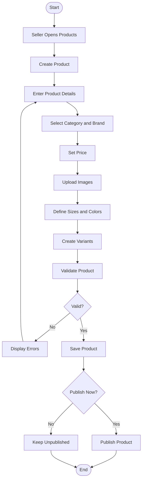
```mermaid
flowchart TD
    A([Start]) --> B[Seller Opens Products]
    B --> C[Create Product]
    C --> D[Enter Product Details]
    D --> E[Select Category and Brand]
    E --> F[Set Price]
    F --> G[Upload Images]
    G --> H[Define Sizes and Colors]
    H --> I[Create Variants]
    I --> J[Validate Product]
    J --> K{Valid?}
    K -->|No| L[Display Errors]
    L --> D
    K -->|Yes| M[Save Product]
    M --> N{Publish Now?}
    N -->|Yes| O[Publish Product]
    N -->|No| P[Keep Unpublished]
    O --> Q([End])
    P --> Q
```

### 4.2 Product Management

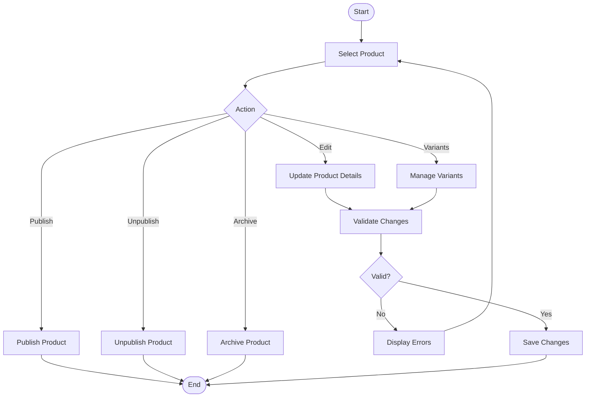
```mermaid
flowchart TD
    A([Start]) --> B[Select Product]
    B --> C{Action}
    C -->|Edit| D[Update Product Details]
    C -->|Variants| E[Manage Variants]
    C -->|Publish| F[Publish Product]
    C -->|Unpublish| G[Unpublish Product]
    C -->|Archive| H[Archive Product]
    D --> I[Validate Changes]
    E --> I
    I --> J{Valid?}
    J -->|No| K[Display Errors]
    K --> B
    J -->|Yes| L[Save Changes]
    F --> M([End])
    G --> M
    H --> M
    L --> M
```

---

## 5. Product Quantity Management

**Priority:** P0 — Manual updates in MVP

### 5.1 Manual Quantity Update

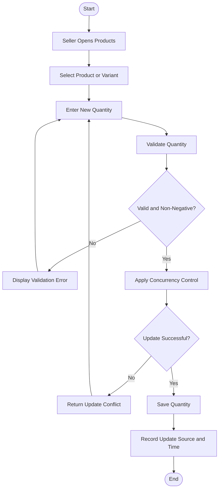
```mermaid
flowchart TD
    A([Start]) --> B[Seller Opens Products]
    B --> C[Select Product or Variant]
    C --> D[Enter New Quantity]
    D --> E[Validate Quantity]
    E --> F{Valid and Non-Negative?}
    F -->|No| G[Display Validation Error]
    G --> D
    F -->|Yes| H[Apply Concurrency Control]
    H --> I{Update Successful?}
    I -->|No| J[Return Update Conflict]
    J --> D
    I -->|Yes| K[Save Quantity]
    K --> L[Record Update Source and Time]
    L --> M([End])
```

### 5.2 Order-Related Quantity Update

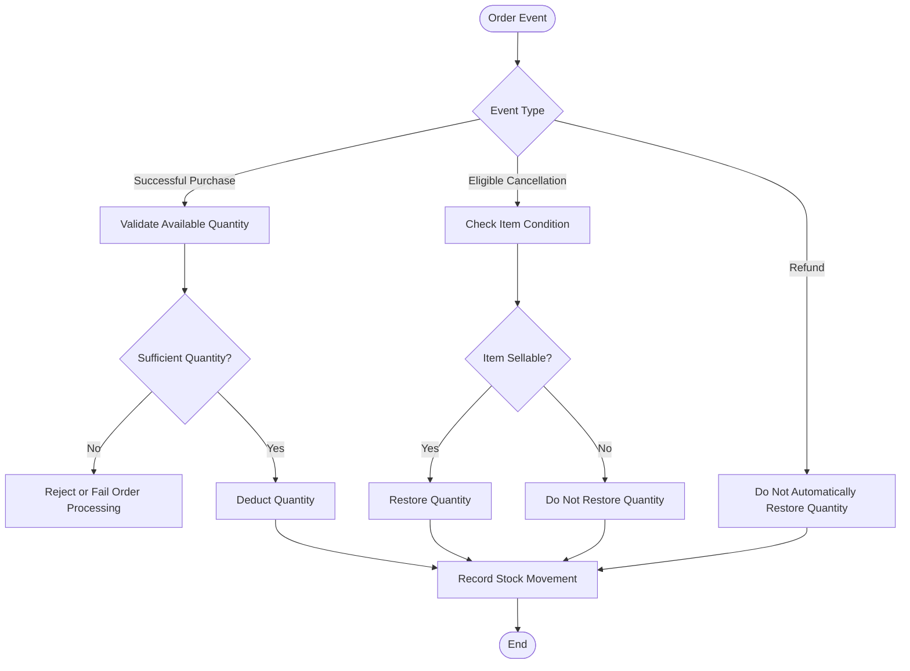
```mermaid
flowchart TD
    A([Order Event]) --> B{Event Type}
    B -->|Successful Purchase| C[Validate Available Quantity]
    C --> D{Sufficient Quantity?}
    D -->|No| E[Reject or Fail Order Processing]
    D -->|Yes| F[Deduct Quantity]
    B -->|Eligible Cancellation| G[Check Item Condition]
    G --> H{Item Sellable?}
    H -->|Yes| I[Restore Quantity]
    H -->|No| J[Do Not Restore Quantity]
    B -->|Refund| K[Do Not Automatically Restore Quantity]
    F --> L[Record Stock Movement]
    I --> L
    J --> L
    K --> L
    L --> M([End])
```

---

## 6. Consumer Shopping Experience

**Priority:** P0 — MVP

### 6.1 Product Discovery

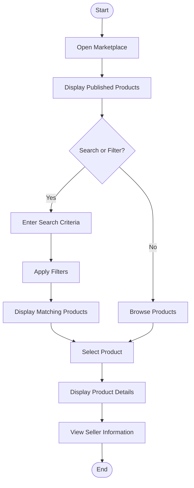
```mermaid
flowchart TD
    A([Start]) --> B[Open Marketplace]
    B --> C[Display Published Products]
    C --> D{Search or Filter?}
    D -->|Yes| E[Enter Search Criteria]
    E --> F[Apply Filters]
    F --> G[Display Matching Products]
    D -->|No| H[Browse Products]
    G --> I[Select Product]
    H --> I
    I --> J[Display Product Details]
    J --> K[View Seller Information]
    K --> L([End])
```

### 6.2 Add Product to Cart

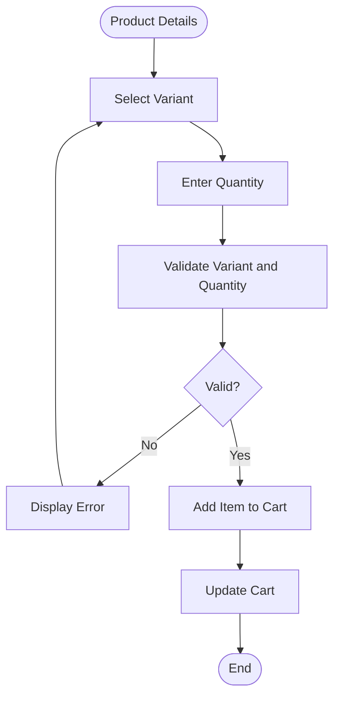
```mermaid
flowchart TD
    A([Product Details]) --> B[Select Variant]
    B --> C[Enter Quantity]
    C --> D[Validate Variant and Quantity]
    D --> E{Valid?}
    E -->|No| F[Display Error]
    F --> B
    E -->|Yes| G[Add Item to Cart]
    G --> H[Update Cart]
    H --> I([End])
```

### 6.3 Shopping Cart Management

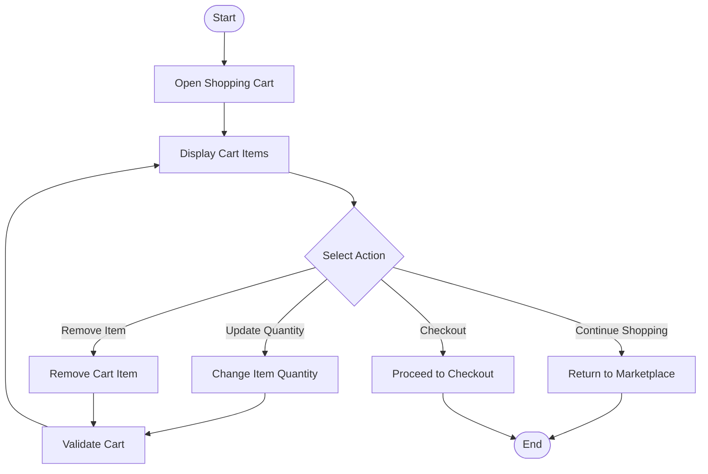
```mermaid
flowchart TD
    A([Start]) --> B[Open Shopping Cart]
    B --> C[Display Cart Items]
    C --> D{Select Action}
    D -->|Update Quantity| E[Change Item Quantity]
    D -->|Remove Item| F[Remove Cart Item]
    D -->|Continue Shopping| G[Return to Marketplace]
    D -->|Checkout| H[Proceed to Checkout]
    E --> I[Validate Cart]
    F --> I
    I --> C
    G --> J([End])
    H --> J
```

---

## 7. Multi-Seller Checkout and Payment

**Priority:** P0 — MVP

### 7.1 Checkout Workflow

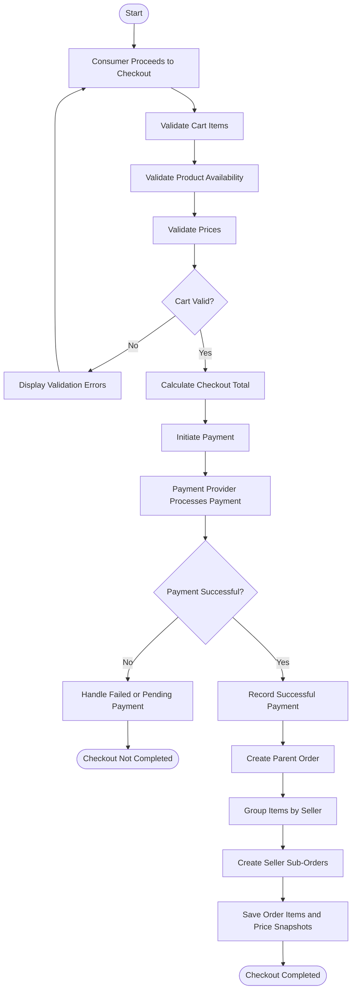
```mermaid
flowchart TD
    A([Start]) --> B[Consumer Proceeds to Checkout]
    B --> C[Validate Cart Items]
    C --> D[Validate Product Availability]
    D --> E[Validate Prices]
    E --> F{Cart Valid?}
    F -->|No| G[Display Validation Errors]
    G --> B
    F -->|Yes| H[Calculate Checkout Total]
    H --> I[Initiate Payment]
    I --> J[Payment Provider Processes Payment]
    J --> K{Payment Successful?}
    K -->|No| L[Handle Failed or Pending Payment]
    L --> M([Checkout Not Completed])
    K -->|Yes| N[Record Successful Payment]
    N --> O[Create Parent Order]
    O --> P[Group Items by Seller]
    P --> Q[Create Seller Sub-Orders]
    Q --> R[Save Order Items and Price Snapshots]
    R --> S([Checkout Completed])
```

### 7.2 Multi-Seller Order Creation

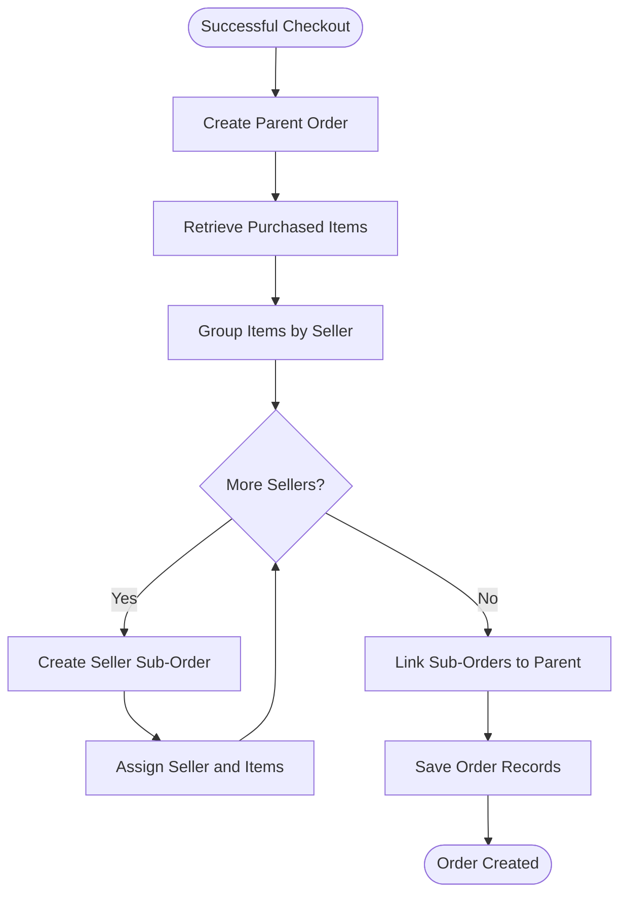
```mermaid
flowchart TD
    A([Successful Checkout]) --> B[Create Parent Order]
    B --> C[Retrieve Purchased Items]
    C --> D[Group Items by Seller]
    D --> E{More Sellers?}
    E -->|Yes| F[Create Seller Sub-Order]
    F --> G[Assign Seller and Items]
    G --> E
    E -->|No| H[Link Sub-Orders to Parent]
    H --> I[Save Order Records]
    I --> J([Order Created])
```

### 7.3 Payment Status Handling

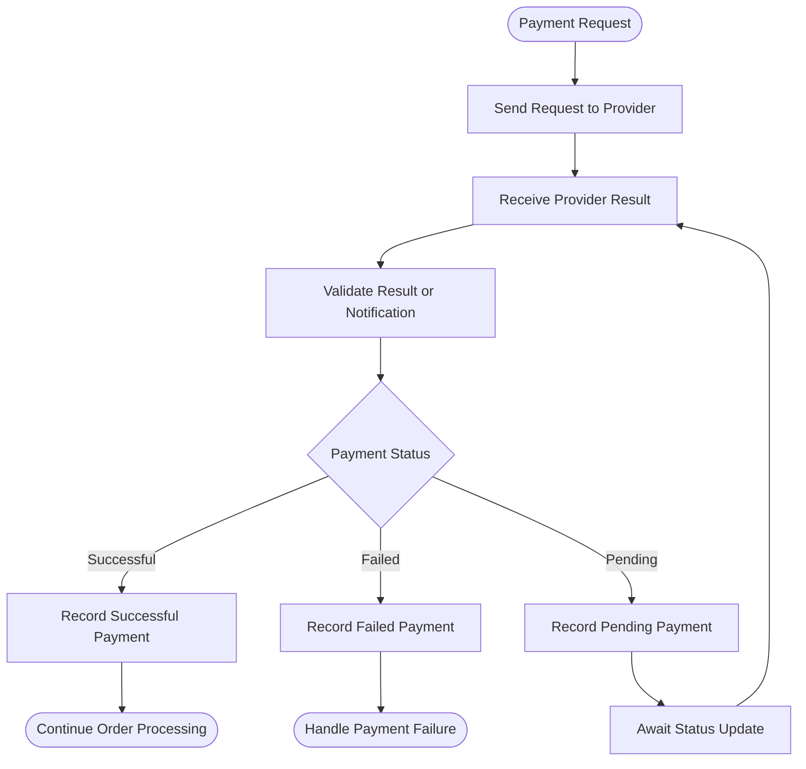
```mermaid
flowchart TD
    A([Payment Request]) --> B[Send Request to Provider]
    B --> C[Receive Provider Result]
    C --> D[Validate Result or Notification]
    D --> E{Payment Status}
    E -->|Successful| F[Record Successful Payment]
    E -->|Failed| G[Record Failed Payment]
    E -->|Pending| H[Record Pending Payment]
    H --> I[Await Status Update]
    I --> C
    F --> J([Continue Order Processing])
    G --> K([Handle Payment Failure])
```

---

## 8. Commission and Seller Earnings

**Priority:** P0 — Basic configuration in MVP

### 8.1 Commission Calculation

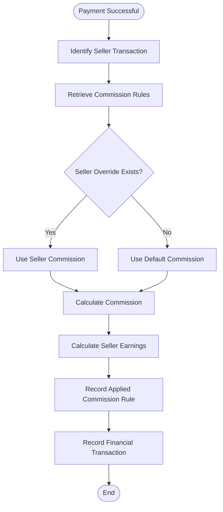
```mermaid
flowchart TD
    A([Payment Successful]) --> B[Identify Seller Transaction]
    B --> C[Retrieve Commission Rules]
    C --> D{Seller Override Exists?}
    D -->|Yes| E[Use Seller Commission]
    D -->|No| F[Use Default Commission]
    E --> G[Calculate Commission]
    F --> G
    G --> H[Calculate Seller Earnings]
    H --> I[Record Applied Commission Rule]
    I --> J[Record Financial Transaction]
    J --> K([End])
```

### 8.2 Seller Payout

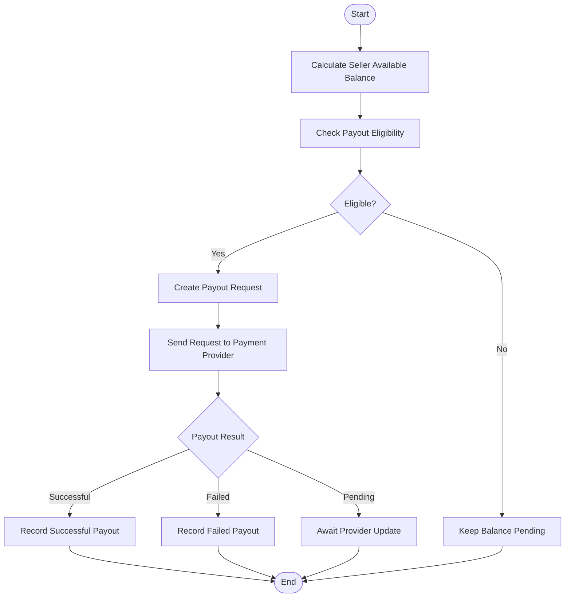
```mermaid
flowchart TD
    A([Start]) --> B[Calculate Seller Available Balance]
    B --> C[Check Payout Eligibility]
    C --> D{Eligible?}
    D -->|No| E[Keep Balance Pending]
    D -->|Yes| F[Create Payout Request]
    F --> G[Send Request to Payment Provider]
    G --> H{Payout Result}
    H -->|Successful| I[Record Successful Payout]
    H -->|Failed| J[Record Failed Payout]
    H -->|Pending| K[Await Provider Update]
    I --> L([End])
    J --> L
    K --> L
    E --> L
```

*Note: Payout workflow depends on the selected payment provider and approved payout policy.*

---

## 9. Order and Shipment Management

**Priority:** P0 — MVP

### 9.1 Seller Order Processing

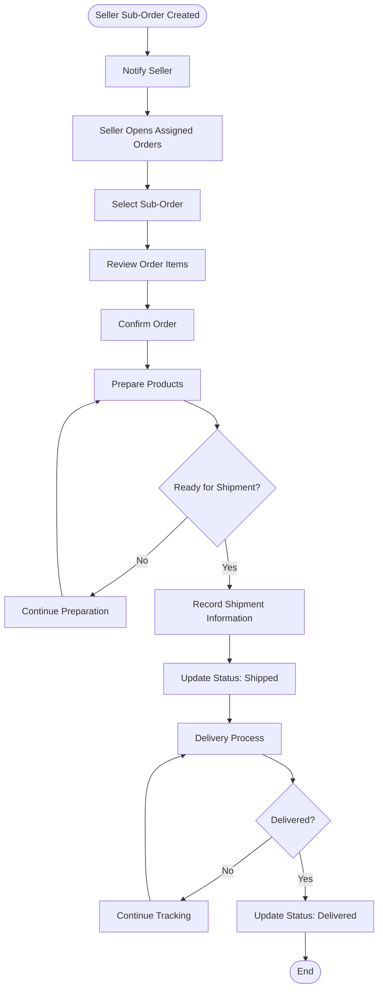
```mermaid
flowchart TD
    A([Seller Sub-Order Created]) --> B[Notify Seller]
    B --> C[Seller Opens Assigned Orders]
    C --> D[Select Sub-Order]
    D --> E[Review Order Items]
    E --> F[Confirm Order]
    F --> G[Prepare Products]
    G --> H{Ready for Shipment?}
    H -->|No| I[Continue Preparation]
    I --> G
    H -->|Yes| J[Record Shipment Information]
    J --> K[Update Status: Shipped]
    K --> L[Delivery Process]
    L --> M{Delivered?}
    M -->|No| N[Continue Tracking]
    N --> L
    M -->|Yes| O[Update Status: Delivered]
    O --> P([End])
```

### 9.2 Consumer Order Tracking

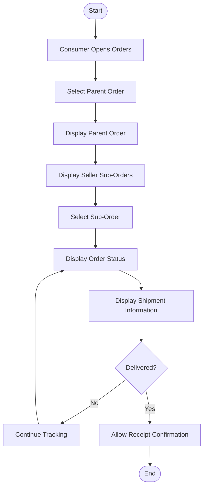
```mermaid
flowchart TD
    A([Start]) --> B[Consumer Opens Orders]
    B --> C[Select Parent Order]
    C --> D[Display Parent Order]
    D --> E[Display Seller Sub-Orders]
    E --> F[Select Sub-Order]
    F --> G[Display Order Status]
    G --> H[Display Shipment Information]
    H --> I{Delivered?}
    I -->|No| J[Continue Tracking]
    J --> G
    I -->|Yes| K[Allow Receipt Confirmation]
    K --> L([End])
```

---

## 10. Cancellation and Refund Management

**Priority:** P0 — Basic handling in MVP

### 10.1 Order Cancellation

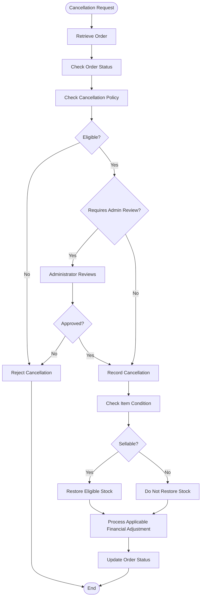
```mermaid
flowchart TD
    A([Cancellation Request]) --> B[Retrieve Order]
    B --> C[Check Order Status]
    C --> D[Check Cancellation Policy]
    D --> E{Eligible?}
    E -->|No| F[Reject Cancellation]
    E -->|Yes| G{Requires Admin Review?}
    G -->|Yes| H[Administrator Reviews]
    H --> I{Approved?}
    I -->|No| F
    I -->|Yes| J[Record Cancellation]
    G -->|No| J
    J --> K[Check Item Condition]
    K --> L{Sellable?}
    L -->|Yes| M[Restore Eligible Stock]
    L -->|No| N[Do Not Restore Stock]
    M --> O[Process Applicable Financial Adjustment]
    N --> O
    O --> P[Update Order Status]
    P --> Q([End])
    F --> Q
```

### 10.2 Exceptional Refund Request

```mermaid
flowchart TD
    A([Refund Request]) --> B[Submit Refund Reason]
    B --> C[Submit Required Evidence]
    C --> D[Administrator Reviews Request]
    D --> E{Approved?}
    E -->|No| F[Reject Refund Request]
    E -->|Yes| G[Initiate Refund]
    G --> H[Payment Provider Processes Refund]
    H --> I{Refund Successful?}
    I -->|No| J[Record Refund Failure]
    I -->|Yes| K[Record Refund Transaction]
    K --> L[Set Status: Refunded]
    L --> M([End])
    F --> M
    J --> M
```

**Important:** A refund does not automatically restore product quantity.

---

## 11. Administrative Workflows

**Priority:** P0 — MVP

### 11.1 Seller Administration

```mermaid
flowchart TD
    A([Administrator Login]) --> B[Open Seller Management]
    B --> C[View Sellers]
    C --> D[Select Seller]
    D --> E{Administrative Action}
    E -->|Review Verification| F[Review Documents]
    E -->|Suspend| G[Suspend Seller]
    E -->|Reactivate| H[Reactivate Seller]
    E -->|View Details| I[Display Seller Information]
    F --> J{Verification Decision}
    J -->|Approve| K[Set Verified]
    J -->|Reject| L[Set Rejected]
    G --> M[Record Administrative Action]
    H --> M
    I --> M
    K --> M
    L --> M
    M --> N([End])
```

### 11.2 Category Management

```mermaid
flowchart TD
    A([Administrator Login]) --> B[Open Category Management]
    B --> C{Action}
    C -->|Create| D[Enter Category Information]
    C -->|Update| E[Select Existing Category]
    C -->|Deactivate| F[Select Category]
    D --> G[Validate Category]
    E --> H[Update Category Information]
    F --> I[Deactivate Category]
    G --> J{Valid?}
    J -->|No| D
    J -->|Yes| K[Save Category]
    H --> K
    I --> L([End])
    K --> L
```

### 11.3 Commission Configuration

```mermaid
flowchart TD
    A([Administrator Login]) --> B[Open Commission Management]
    B --> C{Commission Scope}
    C -->|Default| D[Configure Default Commission]
    C -->|Seller Specific| E[Select Seller]
    E --> F[Configure Seller Override]
    D --> G[Validate Commission Rule]
    F --> G
    G --> H{Valid?}
    H -->|No| I[Display Validation Error]
    I --> G
    H -->|Yes| J[Save Commission Rule]
    J --> K[Record Configuration Change]
    K --> L([End])
```

---

## 12. Seller ERP Integration

**Priority:** P1 — Post-MVP

### 12.1 API Key Generation

```mermaid
flowchart TD
    A([Seller Login]) --> B[Open API Key Management]
    B --> C[Generate API Key]
    C --> D[Create Seller-Scoped Credential]
    D --> E[Display Key Once]
    E --> F[Configure External ERP]
    F --> G([Integration Ready])
```

### 12.2 ERP Product Synchronization

```mermaid
flowchart TD
    A([ERP Sends Request]) --> B[Authenticate API Key]
    B --> C{Valid Credential?}
    C -->|No| D[Return Authentication Error]
    C -->|Yes| E[Identify Owning Seller]
    E --> F[Validate Product Ownership]
    F --> G{Authorized?}
    G -->|No| H[Return Authorization Error]
    G -->|Yes| I[Validate Request Data]
    I --> J{Valid?}
    J -->|No| K[Return Validation Error]
    J -->|Yes| L[Create or Update Product/Variant]
    L --> M[Record Update Source and Time]
    M --> N[Return API Response]
    D --> O([End])
    H --> O
    K --> O
    N --> O
```

---

## 13. AI-Powered Product and Outfit Search

**Priority:** P1 — Post-MVP

### 13.1 AI Search

```mermaid
flowchart TD
    A([Consumer Opens AI Search]) --> B[Enter Natural-Language Request]
    B --> C[Validate Request]
    C --> D{Payload Within 3 MB?}
    D -->|No| E[Reject Request]
    D -->|Yes| F[Send to AI Service]
    F --> G[Interpret User Intent]
    G --> H[Search Marketplace Products]
    H --> I[Filter by Size, Color, Budget and Availability]
    I --> J[Generate Product or Outfit Recommendations]
    J --> K[Validate Product Records]
    K --> L{Products Exist and Available?}
    L -->|No| M[Remove Invalid Recommendations]
    M --> J
    L -->|Yes| N[Display Recommendations]
    N --> O([End])
    E --> O
```

---

## 14. AI Virtual Try-On

**Priority:** P2 — Future

### 14.1 Virtual Try-On

```mermaid
flowchart TD
    A([Consumer Opens Virtual Try-On]) --> B[Upload Image or Use Camera]
    B --> C[Select Product]
    C --> D[Validate Image and Product]
    D --> E{Valid?}
    E -->|No| F[Display Validation Error]
    F --> B
    E -->|Yes| G[Send Request to AI Provider]
    G --> H[Generate Try-On Result]
    H --> I{Successful?}
    I -->|No| J[Display Processing Error]
    I -->|Yes| K[Display Generated Result]
    K --> L{Try Another Product?}
    L -->|Yes| C
    L -->|No| M([End])
    J --> M
```

---

## 15. End-to-End MVP Marketplace Workflow

**Priority:** P0 — MVP

This diagram connects the main MVP workflows into one complete business process.

```mermaid
flowchart TD
    A([Marketplace Start]) --> B[Seller Registration]
    B --> C[Create Store]
    C --> D[Create Products and Variants]
    D --> E[Publish Products]
    E --> F[Consumer Browses Marketplace]
    F --> G[Select Products]
    G --> H[Add Products to Cart]
    H --> I[Proceed to Checkout]
    I --> J[Validate Cart and Availability]
    J --> K{Valid?}
    K -->|No| L[Update Cart]
    L --> I
    K -->|Yes| M[Process Payment]
    M --> N{Payment Successful?}
    N -->|No| O[Handle Payment Failure]
    O --> I
    N -->|Yes| P[Create Parent Order]
    P --> Q[Create Seller Sub-Orders]
    Q --> R[Calculate Commission and Earnings]
    R --> S[Deduct Purchased Quantities]
    S --> T[Seller Processes Orders]
    T --> U[Ship Products]
    U --> V[Deliver Orders]
    V --> W[Consumer Confirms Receipt]
    W --> X[Complete Order Lifecycle]
    X --> Y([End])
```

---

## 16. Workflow Priority Summary

| Workflow | Priority |
|---|---|
| User registration and authentication | P0 |
| Seller registration and verification | P0 |
| Store management | P0 |
| Product and variant management | P0 |
| Manual quantity management | P0 |
| Consumer product discovery | P0 |
| Shopping cart | P0 |
| Multi-seller checkout | P0 |
| Payment processing | P0 |
| Commission calculation | P0 |
| Order and shipment management | P0 |
| Cancellation and refund handling | P0 |
| Administrative management | P0 |
| Seller ERP integration | P1 |
| AI product and outfit search | P1 |
| AI Virtual Try-On | P2 |

---

## 17. Document Status

**Version 1.0 — Workflow Draft**

This document focuses on visual representations of FitFind business processes. Detailed functional requirements, business rules, non-functional requirements, and technical constraints remain documented in the related SRS.

Workflows affected by unresolved business decisions shall be updated after stakeholder approval.